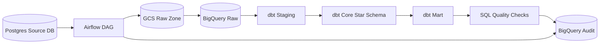
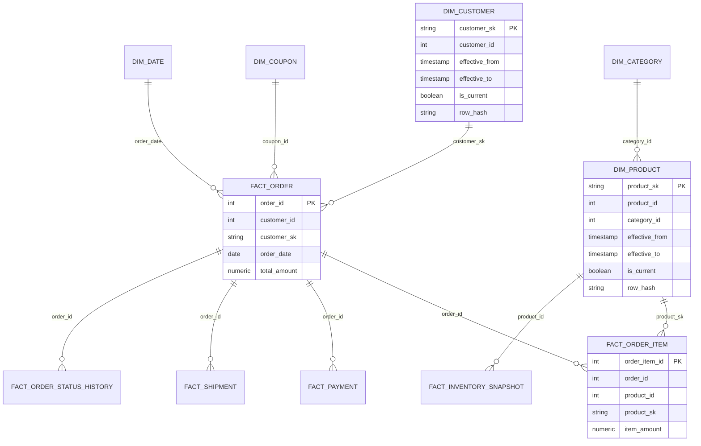

# Ecommerce Data Warehouse Batch Project

쇼핑몰 데이터 웨어하우스 구축 프로젝트입니다. 이 프로젝트는 스트리밍보다 배치 처리, 데이터 모델링, 증분 적재, 멱등성, 품질 검증, 운영 재처리 전략에 집중합니다.

## Project Goal

PostgreSQL 기반 쇼핑몰 운영 데이터를 Airflow로 배치 오케스트레이션하고, GCS Raw Zone과 BigQuery Raw/Staging/Core/Mart 레이어를 거쳐 분석 가능한 데이터 웨어하우스와 데이터마트를 구축합니다. dbt는 BigQuery 내부 변환과 모델링을 담당하며, Fact/Dimension Grain, SCD Type 2, Upsert, 파티션 재처리, SQL 기반 데이터 품질 검증을 명확히 반영합니다.

## Architecture



```text
Postgres
  -> Airflow Extract Task
  -> GCS Raw Zone
  -> Airflow Load Task
  -> BigQuery Raw Dataset
  -> dbt Staging Models
  -> dbt Core Models
  -> dbt Mart Models
  -> SQL Data Quality Checks
```

역할 경계는 다음과 같습니다.

- Postgres: 쇼핑몰 운영 원천 데이터 저장
- Airflow: 배치 파이프라인 오케스트레이션
- GCS: 원천 추출 파일을 보관하는 Raw Data Lake
- BigQuery: 데이터 웨어하우스 저장소
- dbt: BigQuery 내부 SQL 변환과 모델링
- SQL Quality Checks: 핵심 데이터 품질 검증과 감사 결과 저장

## Tech Stack

- Python
- PostgreSQL
- Docker Compose
- Apache Airflow
- Google Cloud Storage
- Google BigQuery
- dbt-bigquery
- SQL
- Faker
- pandas 또는 pyarrow
- google-cloud-storage
- google-cloud-bigquery

## Local Development Environment

로컬 개발 환경은 Docker Compose로 구성합니다.

주요 컨테이너:

- `postgres_source`: 쇼핑몰 운영 원천 DB
- `postgres_airflow`: Airflow 메타데이터 DB
- `airflow-init`: Airflow DB 마이그레이션과 관리자 계정 생성
- `airflow-webserver`: Airflow Web UI
- `airflow-scheduler`: Airflow DAG 스케줄러

초기 실행 절차:

```bash
cp .env.example .env
docker compose up airflow-init
docker compose up -d
```

Airflow Web UI:

```text
http://localhost:8080
```

기본 관리자 계정은 `.env`의 `AIRFLOW_ADMIN_USERNAME`, `AIRFLOW_ADMIN_PASSWORD` 값을 사용합니다.

GCP 인증 파일은 프로젝트에서 생성하지 않습니다. WSL2 기준 실제 서비스 계정 JSON은 프로젝트 폴더 밖 `~/.gcp/ecommerce-dw-runner.json`에 두고, Docker Compose에서 컨테이너 내부로 읽기 전용 마운트합니다.

예시:

```text
GOOGLE_APPLICATION_CREDENTIALS_HOST_PATH=${HOME}/.gcp/ecommerce-dw-runner.json
GOOGLE_APPLICATION_CREDENTIALS=/run/secrets/ecommerce-dw-runner.json
```

컨테이너는 `GOOGLE_APPLICATION_CREDENTIALS` 경로를 사용하고, host의 JSON 파일은 Docker Compose secret으로 읽기 전용 마운트됩니다.

## Source Schema and Seed Data

Postgres 원천 스키마 DDL은 다음 파일에 있습니다.

```text
sql/postgres/001_create_source_schema.sql
```

Docker Compose의 `postgres_source` 컨테이너는 초기 생성 시 `sql/postgres` 디렉터리의 SQL을 실행합니다.

샘플 데이터 생성 스크립트:

```text
scripts/generate_data/generate_seed_data.py
```

로컬 Python 환경에서 실행하려면 먼저 의존성을 설치합니다.

```bash
pip install -r requirements.txt
```

컨테이너 실행 후 로컬에서 예시:

```bash
python3 scripts/generate_data/generate_seed_data.py --reset --with-incremental-changes
```

Airflow 컨테이너 내부에서 예시:

```bash
docker compose exec airflow-scheduler python /opt/airflow/scripts/generate_data/generate_seed_data.py --reset --with-incremental-changes
```

생성 대상 원천 테이블:

- `customers`
- `products`
- `categories`
- `orders`
- `order_items`
- `payments`
- `shipments`
- `inventory_snapshots`
- `coupons`
- `order_status_history`

`--with-incremental-changes` 옵션은 일부 고객, 상품, 주문 데이터를 최근 `updated_at`으로 변경해 이후 단계의 high watermark 증분 적재 테스트에 사용합니다.

## Postgres to GCS Raw Extract

증분 추출 스크립트는 다음 파일에 있습니다.

```text
scripts/extract/postgres_to_gcs.py
```

metadata 테이블 DDL:

```text
sql/postgres/002_create_etl_metadata.sql
```

추출 기준:

```sql
updated_at > last_success_watermark
and updated_at <= current_run_watermark
```

GCS Raw Zone 경로:

```text
gs://{bucket}/ecommerce/raw/{table_name}/extract_date=YYYY-MM-DD/batch_id={batch_id}/{table_name}.parquet
```

Parquet 파일에는 다음 메타 컬럼을 추가합니다.

- `extract_date`
- `extracted_at`
- `source_table`
- `batch_id`

로컬 Parquet 생성만 테스트:

```bash
python3 scripts/extract/postgres_to_gcs.py --table orders --local-only
```

GCS 업로드 포함 실행:

```bash
python3 scripts/extract/postgres_to_gcs.py --table all --batch-id batch_20250101
```

중요한 운영 규칙:

- 추출 성공만으로 `last_success_watermark`를 갱신하지 않습니다.
- 추출 단계에서는 `etl_watermarks.status`와 `current_run_watermark`만 기록합니다.
- `last_success_watermark`는 이후 GCS 저장, BigQuery Raw 적재, dbt 모델 실행, 품질 검증이 모두 성공한 뒤 갱신합니다.
- 같은 `batch_id`를 재실행하면 동일 GCS 객체 경로에 다시 업로드되어 멱등적으로 덮어씁니다.

## GCS to BigQuery Raw Load

BigQuery Raw 적재 스크립트는 다음 파일에 있습니다.

```text
scripts/load/gcs_to_bigquery_raw.py
```

BigQuery Raw/Audit DDL 템플릿:

```text
sql/bigquery/001_create_raw_tables.sql
```

DDL 파일의 `{project_id}`는 실제 GCP 프로젝트 ID로 치환해 실행합니다. Raw 테이블은 이 DDL로 먼저 생성한 뒤 Load Job을 실행하는 흐름을 기준으로 합니다.

기본 적재 방식은 BigQuery Load Job입니다. GCS Raw Zone의 Parquet 파일을 테이블별 Raw 테이블에 append하되, 같은 `batch_id`를 재실행할 때는 대상 Raw 테이블에서 해당 `batch_id`를 먼저 삭제한 뒤 다시 적재합니다.

예시:

```bash
python3 scripts/load/gcs_to_bigquery_raw.py \
  --gcs-uri gs://your-gcs-bucket-name/ecommerce/raw/orders/extract_date=2025-01-01/batch_id=batch_20250101/orders.parquet
```

여러 파일 적재:

```bash
python3 scripts/load/gcs_to_bigquery_raw.py \
  --gcs-uri gs://your-gcs-bucket-name/ecommerce/raw/orders/extract_date=2025-01-01/batch_id=batch_20250101/orders.parquet \
  --gcs-uri gs://your-gcs-bucket-name/ecommerce/raw/order_items/extract_date=2025-01-01/batch_id=batch_20250101/order_items.parquet
```

URI 파싱과 대상 테이블 확인만 수행:

```bash
python3 scripts/load/gcs_to_bigquery_raw.py \
  --gcs-uri gs://your-gcs-bucket-name/ecommerce/raw/orders/extract_date=2025-01-01/batch_id=batch_20250101/orders.parquet \
  --dry-run
```

Raw 적재 감사 결과는 다음 테이블에 기록합니다.

```text
ecommerce_audit.raw_load_runs
```

## dbt Staging Layer

dbt 프로젝트는 다음 경로에 있습니다.

```text
dbt/ecommerce_dw
```

주요 파일:

- `dbt_project.yml`
- `profiles.yml.example`
- `models/staging/sources.yml`
- `models/staging/schema.yml`
- `models/staging/stg_*.sql`
- `macros/dedupe_latest.sql`
- `macros/generate_schema_name.sql`
- `tests/assert_stg_inventory_snapshots_unique.sql`

Staging Layer 역할:

- Raw Layer 컬럼 타입 표준화
- 분석에 필요한 파생 일자 컬럼 추가
- `updated_at`, `extracted_at`, `loaded_at` 기준 최신 row dedupe
- `is_deleted` soft delete 기준 컬럼 유지
- dbt 기본 테스트 정의

dbt 실행 예시:

```bash
cd dbt/ecommerce_dw
dbt debug --profiles-dir .
dbt source freshness --profiles-dir .
dbt run --select staging --profiles-dir .
dbt test --select staging --profiles-dir .
```

`profiles.yml.example`을 참고해 로컬 또는 Airflow 실행 환경에 `profiles.yml`을 준비합니다. 실제 `profiles.yml`은 `.gitignore`에 의해 제외됩니다.

## dbt Core Layer

Core Layer는 스타 스키마를 구현합니다.

Dimension:

- `dim_date`
- `dim_category`
- `dim_coupon`
- `dim_customer`
- `dim_product`

Fact:

- `fact_order`
- `fact_order_item`
- `fact_payment`
- `fact_shipment`
- `fact_inventory_snapshot`
- `fact_order_status_history`

Core 모델 실행 예시:

```bash
cd dbt/ecommerce_dw
dbt run --select core --profiles-dir .
dbt test --select core --profiles-dir .
```

`dim_customer`, `dim_product`는 `row_hash` 기반 SCD Type 2 구조를 사용합니다. Fact 모델은 Natural Key 기준 dbt incremental `merge`로 Upsert되며, 주요 Fact에는 BigQuery 파티션과 클러스터링 설정을 포함합니다.

## dbt Mart Layer

Mart Layer는 비즈니스 분석 목적의 집계 모델을 구현합니다.

Mart:

- `mart_daily_sales`: 일별/카테고리별 매출 분석
- `mart_product_sales`: 일별/상품별 판매 성과 분석
- `mart_customer_ltv`: 고객별 LTV와 세그먼트 분석
- `mart_monthly_retention`: cohort 기준 월별 리텐션 분석

Mart 모델 실행 예시:

```bash
cd dbt/ecommerce_dw
dbt run --select mart --profiles-dir .
dbt test --select mart --profiles-dir .
```

재처리 전략:

- `mart_daily_sales`: `sales_date` 파티션 기준 insert overwrite
- `mart_product_sales`: `sales_date` 파티션 기준 insert overwrite
- `mart_monthly_retention`: `cohort_month` 파티션 기준 insert overwrite
- `mart_customer_ltv`: `customer_id` 기준 merge

Airflow 통합 단계에서는 재처리 대상 날짜 범위를 명확히 넘겨 파티션 단위 Delete & Insert 또는 insert overwrite 실행 흐름을 구성합니다.

## Layer Design

### Raw Layer

GCS에서 BigQuery로 로드된 원천 데이터를 거의 그대로 보관합니다. 원천 스키마를 최대한 유지하고 `extract_date`, `loaded_at`, `batch_id` 같은 추적 컬럼을 포함합니다.

### Staging Layer

Raw 데이터를 분석 가능한 표준 형태로 정리합니다. 컬럼명 표준화, 타입 캐스팅, 기본 중복 제거, soft delete 기준 정리를 수행합니다.

### Core Layer

스타 스키마 기반의 Fact/Dimension 모델을 생성합니다. `dim_customer`, `dim_product`는 SCD Type 2를 적용하고, Fact 테이블은 명확한 Natural Key와 Grain을 기준으로 관리합니다.

### Mart Layer

비즈니스 분석 목적의 집계 테이블을 생성합니다. 일별 매출, 상품별 성과, 고객 LTV, 월별 리텐션 분석을 지원합니다.

## Source Domain

Postgres 원천 DB는 다음 쇼핑몰 운영 테이블로 구성합니다.

- customers
- products
- categories
- orders
- order_items
- payments
- shipments
- inventory_snapshots
- coupons
- order_status_history

모든 원천 테이블은 `created_at`, `updated_at`을 포함하며, 가능한 경우 soft delete 처리를 위한 `is_deleted`를 포함합니다.

## Core Data Model



Dimension:

- dim_customer
- dim_product
- dim_category
- dim_date
- dim_coupon

Fact:

- fact_order
- fact_order_item
- fact_payment
- fact_shipment
- fact_inventory_snapshot
- fact_order_status_history

Mart:

- mart_daily_sales
- mart_product_sales
- mart_customer_ltv
- mart_monthly_retention

## Grain Summary

| Table | Grain | Natural Key |
| --- | --- | --- |
| fact_order | 주문 1건당 1 row | order_id |
| fact_order_item | 주문 상품 항목 1개당 1 row | order_item_id |
| fact_payment | 결제 시도 1건당 1 row | payment_id |
| fact_shipment | 배송 1건당 1 row | shipment_id |
| fact_inventory_snapshot | 상품-일자별 재고 스냅샷 1 row | snapshot_date + product_id |
| fact_order_status_history | 주문 상태 변경 이벤트 1건당 1 row | order_status_history_id |
| dim_customer | 고객 속성 변경 이력 1건당 1 row | customer_id |
| dim_product | 상품 속성 변경 이력 1건당 1 row | product_id |

## Incremental Load Strategy

증분 적재는 `updated_at` 기반 high watermark 방식을 사용합니다. 추출 성공만으로 watermark를 갱신하지 않고, GCS 저장, BigQuery Raw 적재, dbt 모델 실행, 품질 검증이 모두 성공한 후에만 갱신합니다.

메타데이터는 다음 항목을 관리합니다.

- pipeline_name
- source_table
- last_success_watermark
- current_run_watermark
- last_run_at
- status
- row_count
- error_message

## SCD Type 2 Strategy

`dim_customer`, `dim_product`는 SCD Type 2를 적용합니다. 변경 감지는 비즈니스 속성 기반 `row_hash`로 수행하며, 다음 컬럼을 포함합니다.

- surrogate key
- natural key
- effective_from
- effective_to
- is_current
- row_hash
- created_at
- updated_at

## Upsert and Idempotency

- Raw Layer는 `batch_id`와 GCS 경로 규칙을 통해 같은 배치 재실행 시 중복을 제어합니다.
- Core Layer의 Fact/Dimension은 BigQuery `MERGE` 기준 Key를 명확히 두고 Upsert합니다.
- Mart Layer는 날짜 파티션 단위 Delete & Insert 방식으로 재처리합니다.
- Airflow Task 실패 시 watermark를 갱신하지 않습니다.

## Data Quality

데이터 품질 검증은 dbt test와 별도 SQL 검증을 함께 사용합니다.

dbt test:

- not_null
- unique
- relationships
- accepted_values

별도 SQL 검증:

- freshness
- row count comparison
- duplicate check
- amount/date range check
- mart metric sanity check
- mart aggregate validation

검증 결과는 `ecommerce_audit.data_quality_results`에 저장합니다.

## Documents

- [Architecture](docs/architecture.md)
- [Data Model](docs/data_model.md)
- [Pipeline Design](docs/pipeline_design.md)
- [Data Quality](docs/data_quality.md)
- [Operations](docs/operations.md)

## Portfolio Focus

이 프로젝트에서 강조할 점은 단순 ETL 코드가 아니라 실무형 DW 설계 역량입니다.

- 레이어별 책임 분리
- Fact/Dimension Grain 명시
- SCD Type 2 설계
- `updated_at` 기반 증분 적재
- BigQuery MERGE 기반 Upsert
- 파티션 단위 Mart 재처리
- 실패 시 watermark 보존
- SQL 기반 품질 검증
- 재실행해도 중복이 발생하지 않는 멱등성

## SQL Data Quality Checks

SQL 기반 데이터 품질 검증은 다음 파일로 구성합니다.

- `sql/bigquery/002_create_data_quality_tables.sql`
- `sql/bigquery/quality_checks.sql`
- `scripts/quality/run_bigquery_quality_checks.py`

검증 결과 저장 테이블:

```text
ecommerce_audit.data_quality_results
```

실행 예시:

```bash
python3 scripts/quality/run_bigquery_quality_checks.py \
  --execution-date 2025-01-01 \
  --batch-id batch_20250101
```

GCP 연결 없이 검증 목록만 확인:

```bash
python3 scripts/quality/run_bigquery_quality_checks.py --dry-run
```

ERROR severity 검증이 실패하거나 쿼리 오류가 발생하면 스크립트는 비정상 종료합니다. Airflow 통합 단계에서는 이 종료 코드를 사용해 파이프라인을 실패 처리하고 watermark 갱신을 막습니다.

## Airflow DAG

Airflow 통합 DAG는 다음 파일입니다.

```text
airflow/dags/ecommerce_daily_pipeline.py
```

TaskGroup 구성:

- `seed`
- `extract`
- `load_raw`
- `dbt_staging`
- `dbt_core`
- `dbt_mart`
- `quality_check`
- `metadata_update`

보조 스크립트:

- `scripts/load/load_manifest_to_bigquery_raw.py`
- `scripts/metadata/update_watermarks.py`
- `scripts/dbt/run_dbt.sh`

실행 순서:

```text
seed
  -> extract
  -> load_raw
  -> dbt_staging
  -> dbt_core
  -> dbt_mart
  -> quality_check
  -> metadata_update
```

`metadata_update`는 모든 선행 단계가 성공한 경우에만 실행됩니다. 따라서 추출, Raw 적재, dbt 실행, dbt test, SQL 품질검증 중 하나라도 실패하면 `last_success_watermark`는 갱신되지 않습니다.

## Backfill and Reprocessing

DAG는 `dag_run.conf`로 재처리 범위를 받을 수 있습니다.

예시 DAG run config:

```json
{
  "batch_id": "backfill_20250101_20250107",
  "start_watermark": "2025-01-01T00:00:00",
  "end_watermark": "2025-01-08T00:00:00",
  "mart_start_date": "2025-01-01",
  "mart_end_date": "2025-01-07",
  "watermark_mode": "preserve"
}
```

재처리 기준:

- `start_watermark`, `end_watermark`: Postgres `updated_at` 추출 범위
- `batch_id`: GCS Raw 경로와 BigQuery Raw 중복 제어 기준
- `mart_start_date`, `mart_end_date`: Mart 파티션 재처리 범위
- `watermark_mode=preserve`: 백필 성공 후에도 `last_success_watermark`를 전진시키지 않음
- `watermark_mode=advance`: 일반 daily 실행처럼 전체 성공 후 watermark 갱신

같은 `batch_id`를 재실행하면 GCS 객체는 동일 경로에 다시 업로드되고, BigQuery Raw는 동일 `batch_id` rows를 삭제한 뒤 다시 적재합니다. Core는 MERGE, Mart는 파티션 범위 기반 insert overwrite로 재처리합니다.

## End-to-End Run Order

1. `.env.example`을 `.env`로 복사하고 GCP 프로젝트, GCS 버킷, BigQuery dataset 값을 설정합니다.
2. 실제 GCP 서비스 계정 JSON을 WSL2 기준 `~/.gcp/ecommerce-dw-runner.json`에 둡니다.
3. Docker Compose로 Postgres와 Airflow를 실행합니다.
4. BigQuery DDL 템플릿의 `{project_id}`를 실제 프로젝트 ID로 치환해 Raw/Audit 테이블을 생성합니다.
5. Airflow Web UI에서 `ecommerce_daily_pipeline` DAG를 실행합니다.
6. 실행 후 BigQuery의 Raw/Staging/Core/Mart/Audit dataset을 확인합니다.

```bash
cp .env.example .env
docker compose up airflow-init
docker compose up -d
```

## Troubleshooting

- `dbt: command not found`: Airflow 컨테이너의 `_PIP_ADDITIONAL_REQUIREMENTS`에 `dbt-bigquery`가 포함되어 있는지 확인합니다.
- GCP 인증 오류: `GOOGLE_APPLICATION_CREDENTIALS_HOST_PATH`와 `GOOGLE_APPLICATION_CREDENTIALS` 경로를 확인합니다.
- Raw Load 실패: GCS URI가 `gs://{bucket}/ecommerce/raw/{table}/extract_date=YYYY-MM-DD/batch_id={batch_id}/{table}.parquet` 규칙을 따르는지 확인합니다.
- Watermark가 갱신되지 않음: 품질검증 또는 dbt test 실패 여부를 먼저 확인합니다. 실패 시 갱신되지 않는 것이 의도된 동작입니다.
- Backfill 후 daily watermark가 바뀜: 백필 실행 시 `watermark_mode`가 `preserve`인지 확인합니다.

## Interview Talking Points

- Airflow는 처리 로직을 직접 품지 않고 seed, extract, load, dbt, quality, metadata update를 오케스트레이션합니다.
- GCS는 Raw Data Lake로만 사용하고, 분석 모델링은 BigQuery와 dbt에서 수행합니다.
- 증분 추출은 `updated_at` high watermark이며, 전체 파이프라인 성공 후에만 watermark를 전진시킵니다.
- Raw는 `batch_id` 경로와 BigQuery delete-then-load로 중복을 제어합니다.
- Core Fact는 Natural Key 기준 MERGE, Mart는 파티션 단위 재처리 전략을 사용합니다.
- `dim_customer`, `dim_product`는 `row_hash` 기반 SCD Type 2로 변경 이력을 보존합니다.
- dbt test와 별도 SQL 품질검증을 분리해 모델 스키마 검증과 운영성 검증을 함께 다룹니다.

## Limitations and Next Steps

- 로컬 개발용 Docker Compose 구성이며, 운영 배포 자동화는 포함하지 않습니다.
- Terraform, Kubernetes, Kafka, Spark 같은 기술은 의도적으로 제외했습니다.
- BigQuery DDL의 `{project_id}` 치환은 수동 실행 기준입니다.
- SCD Type 2 구현은 포트폴리오용 SQL 모델이며, 대규모 운영 환경에서는 변경 row만 정교하게 처리하도록 최적화할 수 있습니다.
- 향후 개선 방향은 CI에서 `dbt parse/test`, SQL lint, DAG import test를 자동화하는 것입니다.
