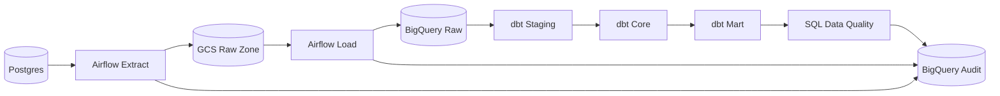

# Architecture

## Overview

이 프로젝트는 쇼핑몰 운영 데이터를 배치 방식으로 수집하고, 데이터 웨어하우스와 데이터마트를 구축하는 구조입니다. 스트리밍이나 분산 처리보다 레이어 설계, 모델링, 증분 적재, 재처리, 품질 검증에 집중합니다.

## Data Flow



```text
Postgres
  -> Airflow Extract Task
  -> GCS Raw Zone
  -> Airflow Load Task
  -> BigQuery Raw Dataset
  -> dbt Staging Models
  -> dbt Core Models
  -> dbt Mart Models
  -> SQL Data Quality Checks
  -> Audit Tables
```

## Component Responsibilities

### PostgreSQL

쇼핑몰 운영 원천 데이터를 저장합니다. 고객, 상품, 주문, 결제, 배송, 재고, 쿠폰, 주문 상태 변경 이력 데이터를 관리합니다.

로컬 개발 환경에서는 두 개의 PostgreSQL 컨테이너를 분리합니다.

- `postgres_source`: 쇼핑몰 원천 데이터 저장
- `postgres_airflow`: Airflow 메타데이터 저장

이렇게 분리해 원천 DB와 오케스트레이션 메타데이터 DB의 책임을 명확히 유지합니다.

모든 주요 테이블은 다음 추적 컬럼을 포함합니다.

- `created_at`
- `updated_at`
- `is_deleted`

### Airflow

Airflow는 데이터 처리 로직을 과도하게 직접 수행하지 않고 오케스트레이션에 집중합니다.

로컬 개발 환경에서는 다음 컨테이너로 구성합니다.

- `airflow-init`
- `airflow-webserver`
- `airflow-scheduler`

주요 책임:

- 샘플 데이터 생성 실행
- Postgres에서 GCS로 추출 작업 실행
- GCS에서 BigQuery Raw로 적재 작업 실행
- dbt 모델 실행
- SQL 기반 데이터 품질 검증 실행
- 모든 단계 성공 후 watermark 갱신

### GCS Raw Zone

GCS는 Raw Data Lake 역할만 담당합니다. 분석 모델링이나 비즈니스 변환은 수행하지 않습니다.

기본 경로 규칙:

```text
gs://{bucket}/ecommerce/raw/{table_name}/extract_date={YYYY-MM-DD}/batch_id={batch_id}/{table_name}.parquet
```

파일 포맷은 Parquet를 사용합니다.

각 파일은 다음 메타 컬럼을 포함합니다.

- `extract_date`
- `extracted_at`
- `source_table`
- `batch_id`

### BigQuery

BigQuery는 데이터 웨어하우스 저장소입니다.

Dataset 구조:

- `ecommerce_raw`
- `ecommerce_staging`
- `ecommerce_core`
- `ecommerce_mart`
- `ecommerce_audit`

Raw Dataset은 GCS Raw Zone의 Parquet 파일을 BigQuery Load Job으로 적재합니다. 같은 `batch_id` 재실행 시 Raw 테이블에서 해당 `batch_id`를 삭제한 뒤 다시 적재해 중복을 제어합니다.

Raw 적재 이력은 `ecommerce_audit.raw_load_runs`에 저장합니다.

### dbt

dbt는 BigQuery 내부 변환과 모델링을 담당합니다.

주요 책임:

- Raw 데이터를 Staging 모델로 표준화
- Core Layer의 Fact/Dimension 모델 생성
- SCD Type 2 Dimension 처리
- Mart Layer 집계 모델 생성
- 기본 dbt test 수행

### SQL Quality Checks

dbt test로 처리하기 어려운 운영성 품질 검증을 별도 SQL로 수행합니다. 결과는 `ecommerce_audit.data_quality_results`에 저장합니다.

## Layer Boundaries

| Layer | Owner | Responsibility |
| --- | --- | --- |
| Source | Postgres | 운영 원천 데이터 |
| Raw Lake | GCS | 추출 파일 보관 |
| Raw DW | BigQuery | 원천 데이터 적재 |
| Staging | dbt | 표준화, 캐스팅, 중복 제거 |
| Core | dbt | 스타 스키마, SCD Type 2, Fact/Dimension |
| Mart | dbt | 분석 목적 집계 |
| Audit | BigQuery + SQL | 품질 검증 결과, 적재 이력 |

## Design Principles

- Airflow는 오케스트레이션에 집중합니다.
- GCS는 Raw Data Lake 역할만 수행합니다.
- BigQuery와 dbt에서 분석 모델링을 수행합니다.
- 증분 적재는 `updated_at` high watermark 기준입니다.
- watermark는 전체 파이프라인 성공 후에만 갱신합니다.
- Core는 BigQuery `MERGE`로 Upsert합니다.
- Mart는 날짜 파티션 단위 Delete & Insert로 재처리합니다.
