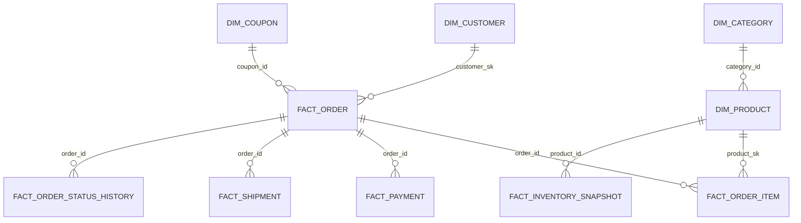

# Data Model

## Modeling Approach

Core Layer는 스타 스키마를 사용합니다. Dimension은 분석 축을 제공하고, Fact는 비즈니스 이벤트와 수치를 저장합니다.

모든 주요 모델은 Grain을 먼저 정의한 뒤 Natural Key, Surrogate Key, 증분 처리 기준을 설계합니다.

## Source Tables

Postgres 원천 테이블:

- `customers`
- `products`
- `categories`
- `orders`
- `order_items`
- `payments`
- `shipments`
- `inventory_snapshots`
- `coupons`
- `order_status_history`

공통 추적 컬럼:

- `created_at`
- `updated_at`
- `is_deleted`

## Dimension Tables

### dim_customer

Grain: 고객 속성 변경 이력 1건당 1 row

Natural Key:

- `customer_id`

Surrogate Key:

- `customer_sk`

SCD Type 2 컬럼:

- `customer_sk`
- `customer_id`
- `effective_from`
- `effective_to`
- `is_current`
- `row_hash`
- `created_at`
- `updated_at`

변경 감지 대상:

- `customer_name`
- `email`
- `phone_number`
- `address`
- `customer_grade`
- `marketing_opt_in`

### dim_product

Grain: 상품 속성 변경 이력 1건당 1 row

Natural Key:

- `product_id`

Surrogate Key:

- `product_sk`

SCD Type 2 컬럼:

- `product_sk`
- `product_id`
- `effective_from`
- `effective_to`
- `is_current`
- `row_hash`
- `created_at`
- `updated_at`

변경 감지 대상:

- `product_name`
- `category_id`
- `list_price`
- `brand`
- `product_status`

### dim_category

Grain: 카테고리 1개당 1 row

Natural Key:

- `category_id`

### dim_date

Grain: 날짜 1일당 1 row

Natural Key:

- `date_day`

### dim_coupon

Grain: 쿠폰 1개당 1 row

Natural Key:

- `coupon_id`

## Fact Tables

### fact_order

Grain: 주문 1건당 1 row

Natural Key:

- `order_id`

Partition:

- `order_date`

Cluster:

- `customer_id`
- `order_status`

### fact_order_item

Grain: 주문 상품 항목 1개당 1 row

Natural Key:

- `order_item_id`

Partition:

- `order_date`

Cluster:

- `product_id`
- `category_id`

### fact_payment

Grain: 결제 시도 1건당 1 row

Natural Key:

- `payment_id`

Partition:

- `payment_date`

Cluster:

- `payment_status`
- `payment_method`

### fact_shipment

Grain: 배송 1건당 1 row

Natural Key:

- `shipment_id`

### fact_inventory_snapshot

Grain: 상품-일자별 재고 스냅샷 1 row

Natural Key:

- `snapshot_date`
- `product_id`

Partition:

- `snapshot_date`

Cluster:

- `product_id`
- `category_id`

### fact_order_status_history

Grain: 주문 상태 변경 이벤트 1건당 1 row

Natural Key:

- `order_status_history_id`

## Mart Tables

### mart_daily_sales

목적: 일별 매출, 주문 수, 결제 금액, 할인 금액을 분석합니다.

Grain: `sales_date + category_id` 1 row

Partition:

- `sales_date`

Cluster:

- `category_id`

### mart_product_sales

목적: 상품별 판매량, 매출, 환불, 카테고리별 성과를 분석합니다.

Grain: `sales_date + product_id` 1 row

Partition:

- `sales_date`

Cluster:

- `product_id`
- `category_id`

### mart_customer_ltv

목적: 고객별 누적 구매 금액, 주문 횟수, 첫 구매일, 최근 구매일, 고객 세그먼트를 분석합니다.

Grain: `customer_id` 1 row

Cluster:

- `customer_id`
- `customer_segment`

### mart_monthly_retention

목적: 월별 cohort 기준 고객 리텐션을 분석합니다.

Grain: `cohort_month + order_month + customer_segment` 1 row

Partition:

- `cohort_month`

Cluster:

- `customer_segment`

## SCD Type 2 Rules

- `row_hash`가 변경되면 기존 current row의 `effective_to`를 닫습니다.
- 변경된 속성으로 새 current row를 생성합니다.
- current row는 `is_current = true`로 표시합니다.
- Fact는 이벤트 발생 시점 기준으로 유효한 Dimension row와 연결합니다.

## Core Implementation

Core Layer는 dbt incremental 모델을 사용합니다. Fact 모델은 Natural Key를 `unique_key`로 두고 BigQuery `merge` 전략을 사용합니다.

SCD Type 2 Dimension:

- `dim_customer`: `customer_sk`, `customer_id`, `effective_from`, `effective_to`, `is_current`, `row_hash`
- `dim_product`: `product_sk`, `product_id`, `effective_from`, `effective_to`, `is_current`, `row_hash`

Fact 파티션/클러스터링:

- `fact_order`: partition `order_date`, cluster `customer_id`, `order_status`
- `fact_order_item`: partition `order_date`, cluster `product_id`, `category_id`
- `fact_payment`: partition `payment_date`, cluster `payment_status`, `payment_method`
- `fact_inventory_snapshot`: partition `snapshot_date`, cluster `product_id`, `category_id`

Core 모델 파일은 `dbt/ecommerce_dw/models/core`에 위치합니다.

## Mart Implementation

Mart Layer는 `dbt/ecommerce_dw/models/mart`에 위치합니다.

- `mart_daily_sales`: `sales_date` partition, `category_id` cluster
- `mart_product_sales`: `sales_date` partition, `product_id`, `category_id` cluster
- `mart_customer_ltv`: `customer_id`, `customer_segment` cluster
- `mart_monthly_retention`: `cohort_month` partition, `customer_segment` cluster

파티션 기반 Mart는 dbt incremental `insert_overwrite`를 사용하고, 고객 LTV Mart는 `customer_id` 기준 incremental `merge`를 사용합니다.

Mart 모델은 dbt vars `mart_start_date`, `mart_end_date`를 받아 재처리 범위를 제어할 수 있습니다. Airflow DAG는 이 값을 `dag_run.conf`에서 읽어 dbt 실행에 전달합니다.
