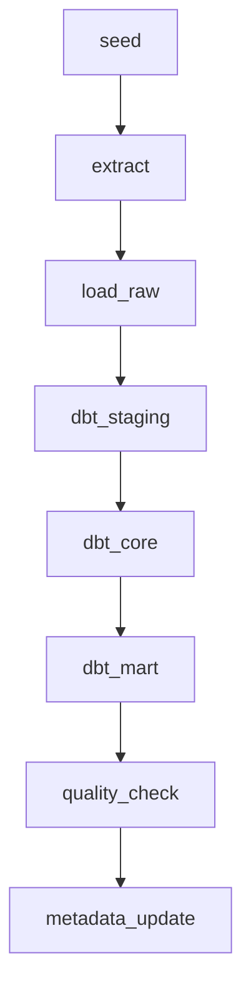

# Pipeline Design

## Overview

파이프라인은 일 배치 기준으로 실행됩니다. Airflow는 단계 간 의존성과 실패 처리를 관리하고, 실제 변환 모델링은 dbt가 BigQuery에서 수행합니다.

로컬 실행 환경은 Docker Compose로 구성합니다. Airflow 컨테이너는 `airflow/dags`, `scripts`, `sql`, `dbt`, `config` 디렉터리를 마운트해 DAG, 스크립트, SQL, dbt 프로젝트를 실행할 수 있게 합니다.

최종 DAG는 seed, extract, load_raw, dbt_staging, dbt_core, dbt_mart, quality_check, metadata_update TaskGroup으로 구성됩니다.



## Airflow Task Groups

Daily pipeline은 다음 TaskGroup 또는 Task 단위로 구성합니다.

1. `seed`
2. `extract`
3. `load_raw`
4. `dbt_staging`
5. `dbt_core`
6. `dbt_mart`
7. `quality_check`
8. `metadata_update`

## Step Responsibilities

### seed

로컬 개발과 테스트를 위해 Postgres 원천 테이블에 샘플 데이터를 생성합니다.

### extract

Postgres 원천 테이블에서 `updated_at` 기준 high watermark 방식으로 증분 데이터를 추출합니다.

추출 조건:

```sql
updated_at > last_success_watermark
and updated_at <= current_run_watermark
```

추출 파일에는 다음 메타 컬럼을 추가합니다.

- `extract_date`
- `extracted_at`
- `source_table`
- `batch_id`

구현 파일:

- `scripts/extract/postgres_to_gcs.py`
- `sql/postgres/002_create_etl_metadata.sql`

metadata 테이블은 `etl_watermarks`, `etl_batch_runs`로 구성합니다. `etl_watermarks.last_success_watermark`는 추출 단계에서 갱신하지 않고, 전체 파이프라인 성공 후 metadata update 단계에서만 갱신합니다.

GCS Raw Zone 경로:

```text
gs://{bucket}/ecommerce/raw/{table_name}/extract_date={YYYY-MM-DD}/batch_id={batch_id}/{table_name}.parquet
```

### load_raw

GCS Raw Zone의 Parquet 파일을 BigQuery Raw Dataset으로 적재합니다. 기본 구현은 BigQuery Load Job을 사용합니다.

Raw 적재 구현 파일:

- `scripts/load/gcs_to_bigquery_raw.py`
- `sql/bigquery/001_create_raw_tables.sql`

적재 대상:

- `ecommerce_raw.{source_table}`

감사 테이블:

- `ecommerce_audit.raw_load_runs`

중복 제어 방식:

1. GCS URI에서 `source_table`, `extract_date`, `batch_id`를 파싱합니다.
2. 대상 Raw 테이블에서 동일 `batch_id` rows를 삭제합니다.
3. BigQuery Load Job으로 Parquet 파일을 append합니다.
4. `loaded_at`을 현재 시각으로 설정합니다.
5. 성공/실패 결과를 audit 테이블에 기록합니다.

### dbt_staging

Raw 데이터를 표준화합니다.

- 컬럼명 표준화
- 타입 캐스팅
- 기본 중복 제거
- soft delete 기준 정리

Staging 구현 파일:

- `dbt/ecommerce_dw/dbt_project.yml`
- `dbt/ecommerce_dw/profiles.yml.example`
- `dbt/ecommerce_dw/models/staging/sources.yml`
- `dbt/ecommerce_dw/models/staging/schema.yml`
- `dbt/ecommerce_dw/models/staging/stg_*.sql`
- `dbt/ecommerce_dw/macros/dedupe_latest.sql`
- `dbt/ecommerce_dw/macros/generate_schema_name.sql`
- `dbt/ecommerce_dw/tests/assert_stg_inventory_snapshots_unique.sql`

중복 제거 기준은 Natural Key별 최신 row입니다. 정렬 우선순위는 `updated_at desc`, `extracted_at desc`, `loaded_at desc`입니다.

### dbt_core

Core Layer 모델을 생성합니다.

- Dimension 생성
- Fact 생성
- SCD Type 2 처리
- Surrogate Key 생성
- Fact와 Dimension 참조 구조 정리

Core 구현 파일:

- `dbt/ecommerce_dw/models/core/dim_*.sql`
- `dbt/ecommerce_dw/models/core/fact_*.sql`
- `dbt/ecommerce_dw/models/core/schema.yml`
- `dbt/ecommerce_dw/macros/surrogate_key.sql`
- `dbt/ecommerce_dw/tests/assert_dim_customer_one_current_row.sql`
- `dbt/ecommerce_dw/tests/assert_dim_product_one_current_row.sql`
- `dbt/ecommerce_dw/tests/assert_fact_inventory_snapshot_unique.sql`

Core Fact 모델은 dbt incremental `merge` 전략을 사용합니다. Dimension 중 `dim_customer`, `dim_product`는 row hash 기반 SCD Type 2 컬럼을 포함합니다.

### dbt_mart

분석 목적 Mart 테이블을 생성합니다.

- `mart_daily_sales`
- `mart_product_sales`
- `mart_customer_ltv`
- `mart_monthly_retention`

Mart는 날짜 파티션 단위 Delete & Insert 방식의 재처리를 기준으로 설계합니다.

Mart 구현 파일:

- `dbt/ecommerce_dw/models/mart/mart_daily_sales.sql`
- `dbt/ecommerce_dw/models/mart/mart_product_sales.sql`
- `dbt/ecommerce_dw/models/mart/mart_customer_ltv.sql`
- `dbt/ecommerce_dw/models/mart/mart_monthly_retention.sql`
- `dbt/ecommerce_dw/models/mart/schema.yml`
- `dbt/ecommerce_dw/tests/assert_mart_daily_sales_unique.sql`
- `dbt/ecommerce_dw/tests/assert_mart_product_sales_unique.sql`
- `dbt/ecommerce_dw/tests/assert_mart_monthly_retention_unique.sql`

Mart 재처리 전략:

- 날짜 파티션 Mart는 dbt incremental `insert_overwrite`로 재처리합니다.
- `mart_customer_ltv`는 `customer_id` 기준 `merge`로 갱신합니다.
- Airflow 통합 단계에서는 실행일 또는 백필 날짜 범위를 기준으로 대상 파티션을 명확히 제어합니다.

### quality_check

dbt test와 별도 SQL 검증을 실행합니다. 실패 시 파이프라인을 실패 처리하고 watermark를 갱신하지 않습니다.

품질검증 구현 파일:

- `sql/bigquery/002_create_data_quality_tables.sql`
- `sql/bigquery/quality_checks.sql`
- `scripts/quality/run_bigquery_quality_checks.py`

검증 실행 흐름:

1. SQL 파일에서 검증 metadata와 쿼리를 파싱합니다.
2. 각 SQL은 `failed_row_count`를 반환합니다.
3. 결과를 `ecommerce_audit.data_quality_results`에 저장합니다.
4. ERROR severity 검증이 실패하면 스크립트를 비정상 종료합니다.
5. Airflow 통합 단계에서는 이 실패를 기준으로 watermark 갱신 여부를 제어합니다.

### metadata_update

모든 선행 단계가 성공한 경우에만 watermark와 적재 메타데이터를 갱신합니다.

DAG 통합 구현 파일:

- `airflow/dags/ecommerce_daily_pipeline.py`
- `scripts/load/load_manifest_to_bigquery_raw.py`
- `scripts/metadata/update_watermarks.py`
- `scripts/dbt/run_dbt.sh`

DAG TaskGroup 순서:

```text
seed
  -> extract
  -> load_raw
  -> dbt_staging
  -> dbt_core
  -> dbt_mart
  -> quality_check
  -> metadata_update
```

`extract` 단계는 manifest JSON을 생성합니다. `load_raw`는 manifest의 GCS URI 목록을 BigQuery Raw로 적재합니다. `metadata_update`는 manifest의 `current_run_watermark`를 사용해 Postgres `etl_watermarks.last_success_watermark`를 갱신합니다.

중요하게, `metadata_update`는 마지막 TaskGroup이므로 선행 단계 중 하나라도 실패하면 실행되지 않습니다.

## Reprocessing Controls

Airflow DAG는 `dag_run.conf`로 다음 값을 받을 수 있습니다.

- `batch_id`
- `start_watermark`
- `end_watermark`
- `mart_start_date`
- `mart_end_date`
- `watermark_mode`

`start_watermark`, `end_watermark`는 Postgres 증분 추출 범위를 직접 지정합니다. `mart_start_date`, `mart_end_date`는 dbt mart 모델에 vars로 전달되어 파티션 재처리 범위를 제어합니다.

`watermark_mode`:

- `advance`: 모든 단계 성공 후 `last_success_watermark` 갱신
- `preserve`: 백필 또는 검증성 재처리 후 `last_success_watermark` 유지

## Watermark Metadata

관리 항목:

- `pipeline_name`
- `source_table`
- `last_success_watermark`
- `current_run_watermark`
- `last_run_at`
- `status`
- `row_count`
- `error_message`

핵심 규칙:

- 추출 성공만으로 watermark를 갱신하지 않습니다.
- GCS 저장, BigQuery Raw 적재, dbt 모델 실행, 품질 검증 성공 후 갱신합니다.
- 실패 시 이전 watermark를 유지합니다.
- 같은 기간 재실행 시 결과 중복이 없어야 합니다.

## Idempotency Strategy

### GCS

같은 `batch_id`를 재실행할 경우 동일 경로를 덮어쓰거나 해당 `batch_id` 경로를 정리한 뒤 다시 적재합니다.

기본 경로:

```text
gs://{bucket}/ecommerce/raw/{table_name}/extract_date={YYYY-MM-DD}/batch_id={batch_id}/{table_name}.parquet
```

### BigQuery Raw

Raw 적재는 `batch_id`와 원천 Natural Key를 기준으로 중복을 제어합니다.

### Core

Core Layer는 BigQuery `MERGE`를 사용합니다. Fact는 Natural Key 기준으로 Upsert하고, SCD Type 2 Dimension은 Natural Key와 `row_hash` 변경 여부를 기준으로 이력을 관리합니다.

### Mart

Mart Layer는 대상 날짜 파티션을 먼저 삭제한 뒤 다시 Insert합니다.
