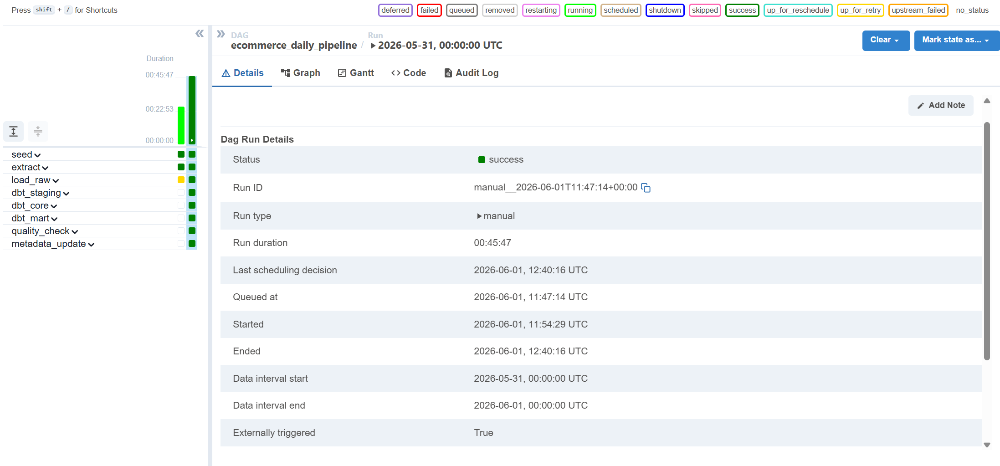
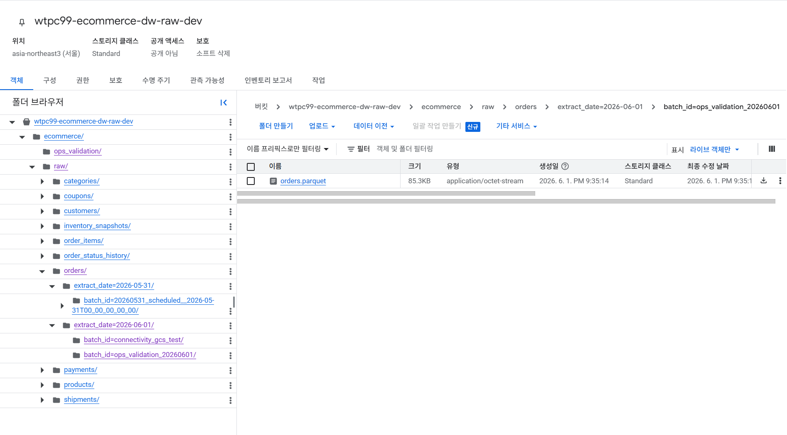
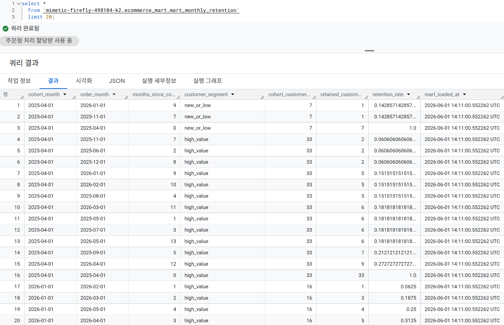
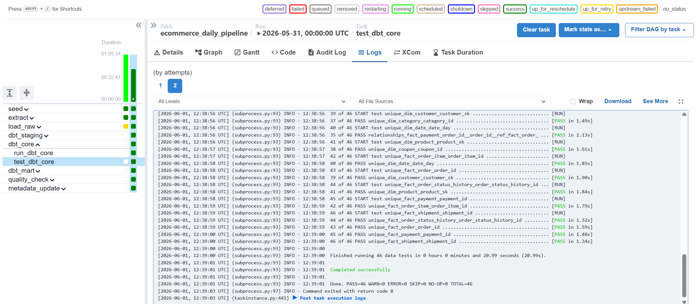
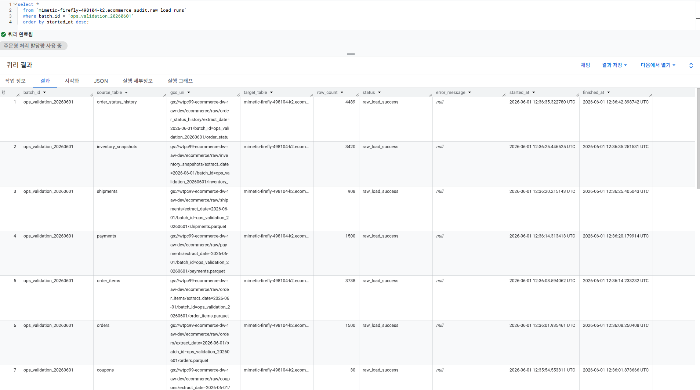
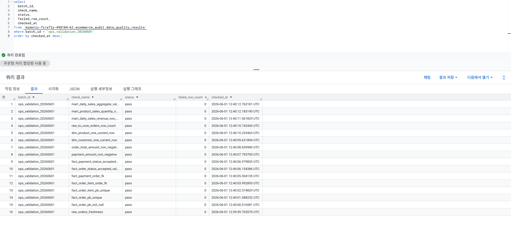

# Operational Validation

이 문서는 `ecommerce_daily_pipeline`의 end-to-end 운영 검증 증거를 정리합니다.

검증 배치:

- DAG: `ecommerce_daily_pipeline`
- Run ID: `manual__2026-06-01T11:47:14+00:00`
- Batch ID: `ops_validation_20260601`
- Result: Airflow DAG 전체 성공

## 1. Airflow DAG Success

Airflow에서 seed, extract, Raw load, dbt staging/core/mart, SQL quality check, metadata update가 모두 성공했습니다.



## 2. GCS Raw Zone

Postgres 원천 데이터는 테이블별 Parquet 파일로 GCS Raw Zone에 저장됩니다.

예시 경로:

```text
gs://wtpc99-ecommerce-dw-raw-dev/ecommerce/raw/orders/extract_date=2026-06-01/batch_id=ops_validation_20260601/orders.parquet
```



## 3. BigQuery Mart Query

dbt Mart 모델 생성 후 BigQuery에서 분석용 Mart 테이블을 조회했습니다.



## 4. dbt Test Pass

Airflow task log에서 `dbt_core.test_dbt_core`가 성공했음을 확인했습니다.



## 5. Raw Load Audit

`ecommerce_audit.raw_load_runs`에 테이블별 Raw Load 성공 이력이 저장됩니다.



## 6. Data Quality Audit

`ecommerce_audit.data_quality_results`에 SQL 기반 품질검증 결과가 저장됩니다. 모든 ERROR severity check가 pass했고 실패 row 수는 0입니다.



